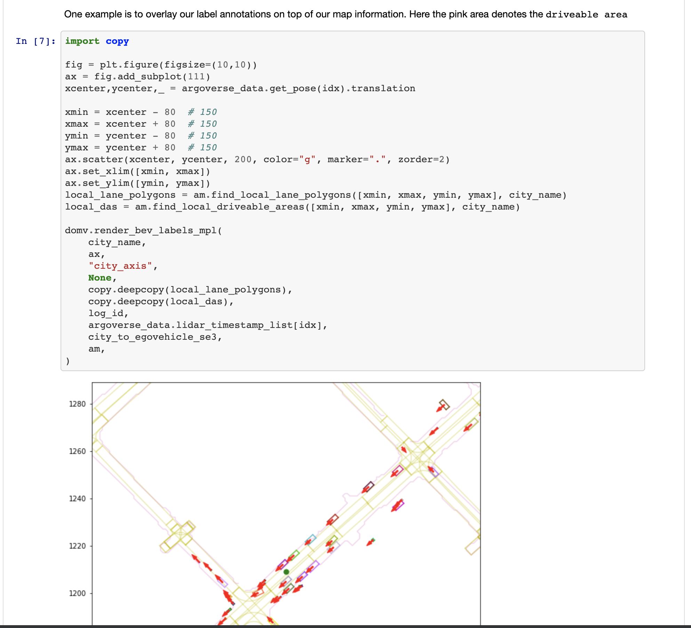
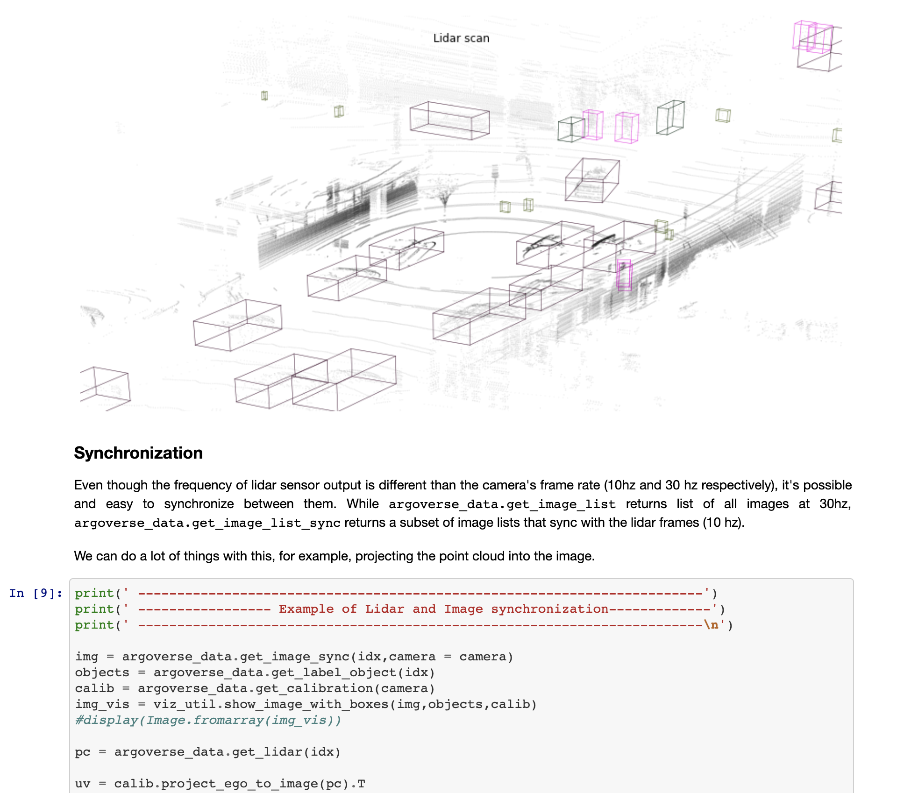
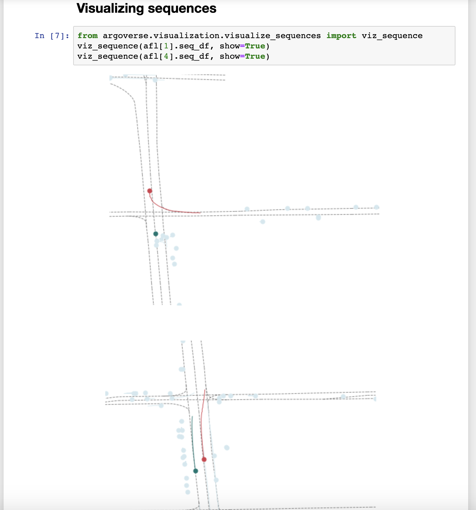
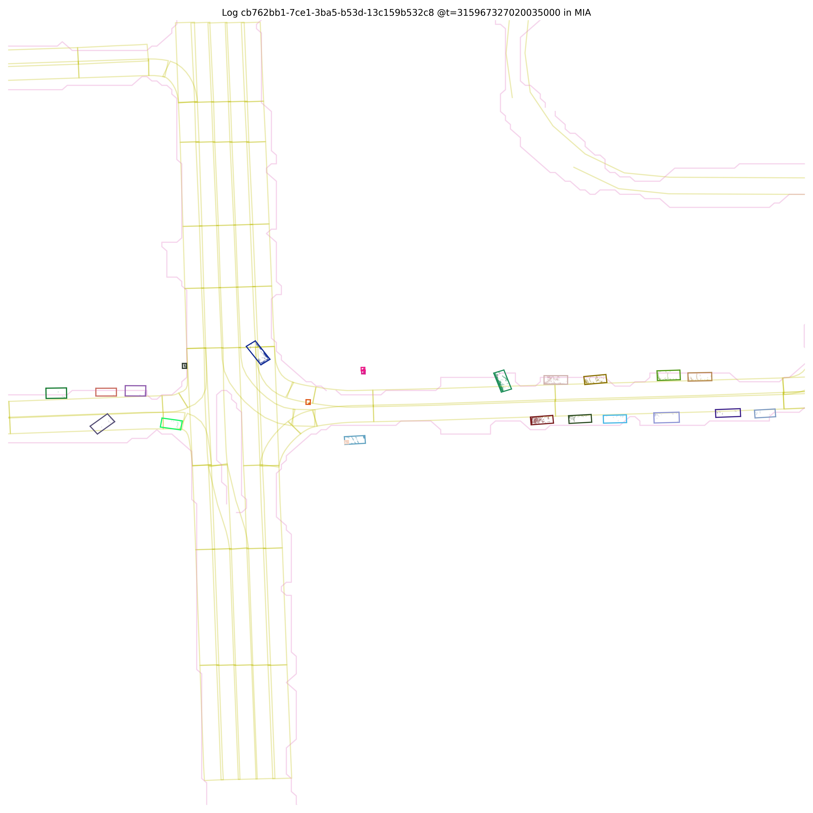
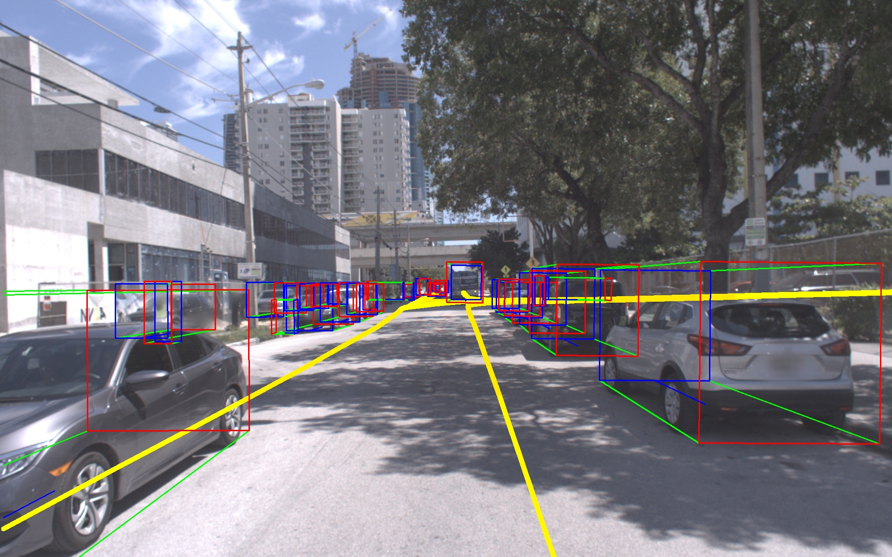
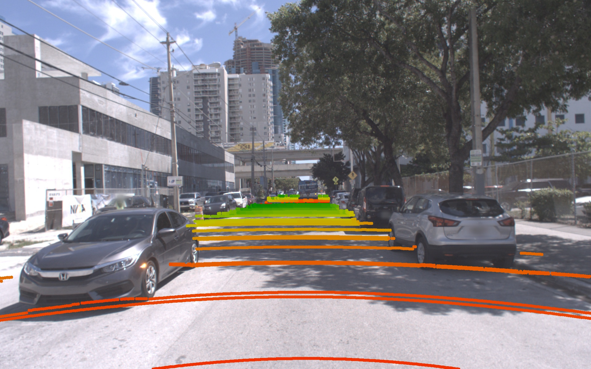

[](https://www.python.org/downloads/release/python-360/)
[](https://www.python.org/downloads/release/python-370/)
[](./LICENSE)
[](https://travis-ci.org/argoai/rich-mapping-api)


---

## Table of Contents

> If you have any questions, feel free to open a [GitHub issue](https://github.com/nikkkkhil/Sementic-Pedestrian-Detection/issues) describing the problem.

- [Installation](#installation)
- [Usage](#usage)
- [Demo](#demo)
- [Baselines](#baselines)
- [Contributing](#contributing)
- [Disclaimer](#disclaimer)


---

## Installation

Requires Linux/MacOS, git, and Python 3.6+

### 1) Clone

- Clone this repo to your local machine using:
```git clone https://github.com/nikkkkhil/Sementic-Pedestrian-Detection.git```

### 2) Download HD map data

- Download `hd_maps.tar.gz` from [our website](https://www.rich-mapping.org/data.html#download-link) and extract into the root directory of the repo. Your directory structure should look something like this:

```
argodataset
└── rich-mapping
    └── data_loading
    └── evaluation
    └── map_representation
    └── utils
    └── visualization
└── map_files
└── license
...
```

### 3) Download rich-mapping-Tracking and rich-mapping-Forecasting

We provide both the full dataset and the sample version of the dataset for testing purposes. Head to [our website](https://www.rich-mapping.org/data.html#download-link) to see the download option.

* **rich-mapping-Tracking** provides track annotations and raw data from camera (@30hz) and lidar sensors (@10hz) as well as two stereo cameras (@5hz). We've released a total 113 scenes/logs, separated into 65 logs for training, 24 logs for validating, and 24 logs for testing. We've separated training data into smaller files to make it easier to download, but you should extract them all into one folder.
    We also provide sample data (1 log) in `tracking_sample.tar.gz`.

* **rich-mapping-Forecasting** contains 327790 sequences of interesting scenarios. Each sequence follows the trajectory of the main agent for 5 seconds, while keeping track of all other actors (e.g car, pedestrian). We've separated them into 208272 training sequences, 40127 validation sequences, and 79391 test sequences.
    We also provide sample data (5 sequences) in `forecasting_sample.tar.gz`.

Note that you need to download HD map data (and extract them into project root folder) for the API to function properly. You can selectively download either **rich-mapping-Tracking** or **rich-mapping-Forecasting** or both, depending on what type of data you need. The data can be extracted to any location in your local machine.

### 4) Install rich-mapping module

* `rich-mapping` can be installed as a python package using

        pip install -e /path_to_root_directory_of_the_repo/
* if you receive any error about `No matching distribution found for pyntcloud`, upgrade your pip using `pip install --upgrade pip` or pip install with `--process-dependency-links`

Make sure that you can run `import rich-mapping` in python, and you are good to go!

### (optional) Install mayavi
* Some visualizations may require `mayavi`. See instructions on how to install Mayavi [here](https://docs.enthought.com/mayavi/mayavi/installation.html).

---

## Usage
The rich-mapping API provides useful functionality to interact with the 3 main components of our dataset: the HD Map, the rich-mapping Tracking Dataset and the rich-mapping Forecasting Dataset.

```python
from rich-mapping.map_representation.map_api import rich-mappingMap
from rich-mapping.data_loading.rich-mapping_tracking_loader import rich-mappingTrackingLoader
from rich-mapping.data_loading.rich-mapping_forecasting_loader import rich-mappingForecastingLoader
avm = rich-mappingMap()
rich-mapping_tracker_loader = rich-mappingTrackingLoader('rich-mapping-tracking/')    #simply change to your local path of the data
rich-mapping_forecasting_loader = rich-mappingForecastingLoader('rich-mapping-forecasting/') #simply change to your local path of the data
```

---

## Demo
To make it easier to use our API, we provide demo tutorials in the form of Jupyter Notebooks.

To run them, you'll need to first install Jupyter Notebook `pip install jupyter`. Then navigate to the repo directory and open a server with `jupyter notebook`. When you run the command, it will open your browser automatically. If you lose the page, you can click on the link in your terminal to re-open the Jupyter notebook.


### **rich-mapping Map Tutorial**
[](./demo_usage/rich-mapping_map_tutorial.ipynb)

### **rich-mapping-Tracking Tutorial**
[](./demo_usage/rich-mapping_tracking_tutorial.ipynb)

### **rich-mapping-Forecasting Tutorial**
[](./demo_usage/rich-mapping_forecasting_tutorial.ipynb)

### Rendering birds-eye-view
Run the following script to render cuboids from a birds-eye-view on the map.
```
$ python visualize_30hz_benchmark_data_on_map.py --dataset_dir <path/to/logs> --log_id <id of the specific log> --experiment_prefix <prefix of the output directory>
```
For example, the path to the logs might be `rich-mapping-tracking/train4` and the log id might be `2bc6a872-9979-3493-82eb-fb55407473c9`.  This script will write to `<experiment prefix>_per_log_viz/<log id>` in the current working directory with images that look like the following: 

It will also generate a video visualization at `<experiment prefix>_per_log_viz/<log id>_lidar_roi_nonground.mp4`

### Rendering cuboids on images
Run the following script to render cuboids on images.
```
$ python cuboids_to_bboxes.py --dataset-dir <path/to/logs> --log-ids <id of specific log> --experiment-prefix <prefix for output directory>
```
This script can process multiple logs if desired.  They can be passed as a comma separated list to `--log-ids`.  Images will be written to `<experiment prefix>_<log id>` in the working directory that look like the following: 

It will also generate video visualizations for each camera in `<experiment prefix>_amodal_labels/`

### Rendering ground lidar points on images
Run the following script to render lidar points corresponding to the ground surface onto images.
```
$ python visualize_ground_lidar_points.py --dataset-dir <path/to/logs> --log-ids <comma separated list of logs>  --experiment-prefix <prefix for output directory>
```
This will produce images and videos will be in the directory `<experiment prefix>_ground_viz/<log id>`.  Here is an example image: 

### Stereo correspondence
For all log segments, accurate calibration between LiDAR and cameras enables sensor fusion approaches, but the calibration may not register the stereo images into perfect epipolar correspondence.

---

## Baselines

We have also released the baseline codes for both 3D tracking and motion forecasting tasks. 
3D Tracking code can be found at https://github.com/alliecc/rich-mapping_baselinetracker and Motion Forecasting code at https://github.com/jagjeet-singh/rich-mapping-forecasting

---

## Contributing
Contributions are always welcome! Please be aware of our [contribution guidelines for this project](CONTRIBUTING.md).

---

---

## License

We release our API under the MIT license. We retain the Apache 2.0 license on certain files. See **[LICENSE](./LICENSE)**
